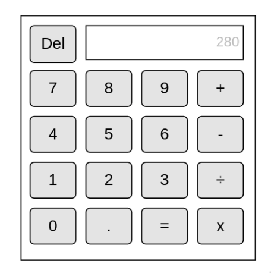

# Build a Calculator 

Build a calculator using HTML, CSS and JavaScript!

# Designing the Calculator

Before we start creating our calculator, we should create a wireframe for our calculator first. 

A wireframe is a layout of your application that shows what you're application would look like and is a critical step in designing any application.
This helps us determine and visualize what the application is supposed to look like and how it is supposed to function.

**What should a calculator look like? What should it be able to do?**

The calculator wireframe below shows us where the buttons and input/display should be within our calculator and their functions.

**_Further Reading:_**

- [What is Wireframing](https://www.experienceux.co.uk/faqs/what-is-wireframing/)
- [Do's and Dont's of Wireframing](https://medium.com/mockplus/10-dos-and-don-ts-of-wireframing-8a6d0b3429d8)