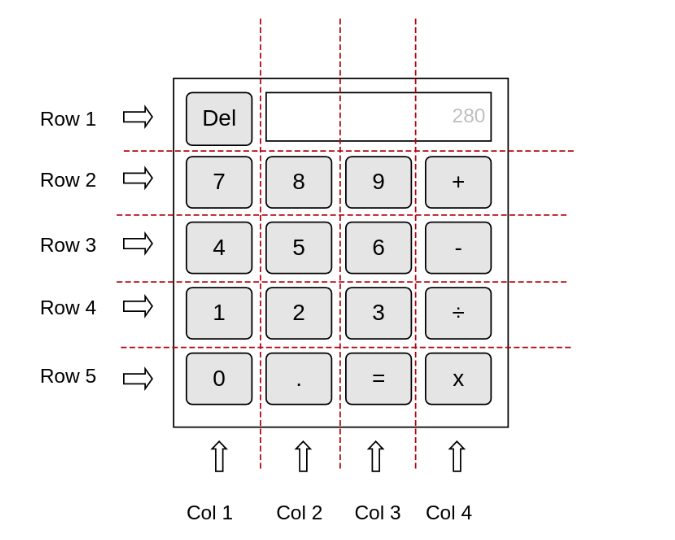

# Creating the Calculator Layout with HTML & CSS

We can divide our calculator into columns and rows as shown in the diagram below.



# Task 1: Create the calculator layout using the Table element

An HTML **table** element can be defined using the `<table>` tag.

Within the **table** element, we can define our table rows `<tr>` and table cells `<td>`.

Follow the diagram above to create the calculator layout using an HTML table element.

**Task Checklist**

- An empty table with the correct rows and columns as shown in the calculator wireframe should be created.

**_Further Reading:_**

- [W3School: HTML Tables](https://www.w3schools.com/html/html_tables.asp)

# Task 2: Create the calculator's display screen

The table cell element `<td>` has an attribute called **colspan**. 

Attributes are extra bits of information which you can add to an HTML element to define its characteristics. They are defined in the element's opening tag and are made up of two parts - **name** and **value**. 

**For example:**

```
<div id="container"></div>
```

- **Name**: property you want to set. In the example above, this is `id`.
- **Value**: the value of the property you want to set. In the example above, this is `"container"`.


Create the layout of the display screen by using the `<td>` element and configure it's **colspan** attribute. This attribute defines the number of columns a cell should span.

To create the display screen, we can use the `<input>` element.

A user should not be able to change this input's value. **What attribute can we use in order to do this?**

**Task Checklist**

- An input screen with the correct width as shown in the wireframe should be created.

**_Further Reading:_**

- [W3School: Attributes](https://www.w3schools.com/html/html_attributes.asp)
- [W3School: Input](https://www.w3schools.com/tags/tag_input.asp)
- [W3School: <td> Tag](https://www.w3schools.com/tags/tag_td.asp)

# Task 3: Create the calculator buttons

Buttons can be created using the `<button>` element.

Add the calculator buttons to your table, following the layout of your wireframe.

**Task Checklist**

- Buttons with the correct values should be placed within the table as shown in the calculator wireframe.

**_Further Reading:_**

- [W3School: Buttons](https://www.w3schools.com/tags/tag_button.asp)


# GIT Checkpoint!

