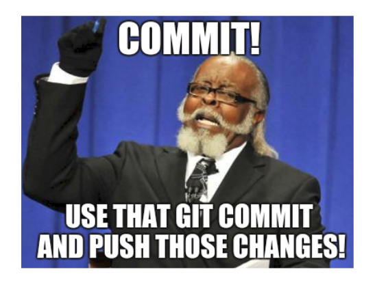

# Creating our Equation
Two of our use cases states that we should be able to create and evaluate an equation using the number and operator buttons in our calculator.

```
- A user should be able to click the number and operator buttons to form an equation.
- A user should be able to see the answer of the equation entered on the display screen when the `=` button is clicked.
```

# Task 1: Building the Equation
**What happens when one of the operators (`+`, `-`, `/`, `*`) is clicked?**

When one of the operators is clicked, the number displayed on the screen and the operator should be added to our string equation. The operator should also be displayed in the display screen as the last character in the display screen value.

**Add an onclick event to our operator buttons**

Add the onclick event to the operator buttons and ensure that it passes the value of each button clicked so we can use this within our function.

**Create a function that gets called when the user clicks an operator button**

Define a function in your JavaScript file which does the following:
- Accept a parameter which holds the value the clicked operator button.
- Concatenates the operator to the display screen value.

This function should then be attached as an `onclick` event to each of our operator buttons.

**Task Checklist**

- Function created which gets called when a user clicks an operator button
- Onclick events attached to each of the operator buttons which adds the operator to our equation.

# Task 2: Evaluating our Equation
**What should happen when the `=` button is pressed?**

When the `=` button is pressed, we need to display the answer of the equation displayed in the display screen.

In order to evaluate the string equation, we can use the **eval()** function. 

**Remember, you can access the display screen value by using the DOM object**

Display the answer of the equation in the display screen.

**Task Checklist**

- When the `=` button is clicked, the equation should be evaluated and the answer shown on the display screen.

**_Further Reading:_**

- [W3School: Eval()](https://www.w3schools.com/jsref/jsref_eval.asp)

# Git Checkpoint!

