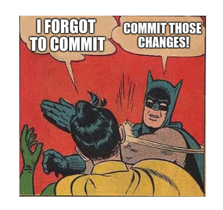

# Test it!
Testing is a very important part of the process when you build an application. Make sure to test and see if your changes are working.

# Bugs Bugs Bugs!
Test your calculator from end to end to see if there's any bugs. Can you find any? Brownie points for finding one and fixing it! Don't be afraid to phone a friend (just grab one of us or anyone passing nearby) :)

# Make it Look Nice
Some tips: 
- `px` is not the only css size unit available. % and em are also useful!
- If you're stuck on colour schemes, find an online colour theme generator (e.g. https://coolors.co/app)
- You can group elements in css so that the style will be implemented to all of the elements declared. For example:

```
div, p { 
  color: black;
}
```
- The defined style will both be applied ot the `<div>` and `<p>` elements in the HTML file.

**_Further Reading:_**
- [W3School: CSS Units](https://www.w3schools.com/cssref/css_units.asp)

# Add More Functionality
What other functionalities can a calculator have? 

# Git Checkpoint!

