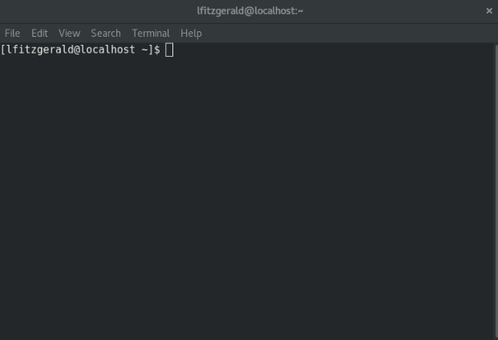
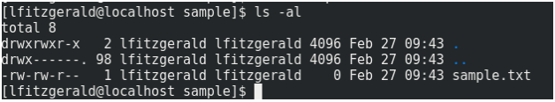
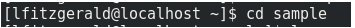

# Terminal

## What is a terminal? 
The terminal is an interface in which you can type and execute text-based commands.

Another way of describing an interface is how something is interacted with. Some examples are: 
- A steering wheel in a car
- A controller of a game console
- A keyboard on a computer
- A graphical user interface (GUI)

Can you think of other examples? 

## Alternative names for a terminal
- Console
- Command Line
- Command Prompt
- Shell

## How to get access to your terminal
This depends on the operating system you are using:
- On Mac
  - Use spotlight search to search for "terminal"
- On Linux
  - Use the search program to search for "terminal"
- On Windows
  - Use the search to search for "cmd"

## Terminal Commands
### Navigating through the terminal
You will see `<username>@<computer><foldername>`. This tells you what folder you are in.

To see the contents of the folder you are currently in type `ls -al` and hit enter. (see the image below for an example).

This will show you a list of all files and folders inside the folder you are currently in.

To move to a different folder inside the folder you are currently in type `cd <folder-name>` (See the image below for an example).

Using these you commands you should be able to get to the folder where your My-First-Website files are stored. This is where we want to initialize (create) our local git repository (project).

**NOTE**: If you go into a folder that you want to get out of type `cd ..` and hit enter. This brings you back up one folder.

In the terminal `.` indicates the current folder and `..` indicates the outer folder.

**NOTE**: You can use tab to complete folder names. E.g type `cd sam` If you hit tab at this point and there is a folder that matches like the sample folder, the terminal will complete it for you.
